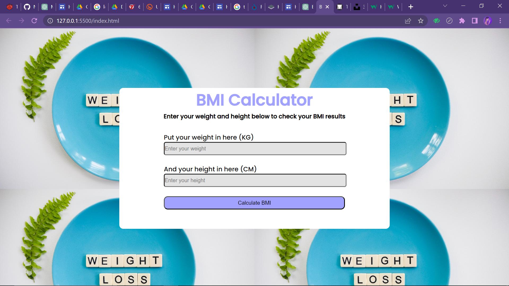
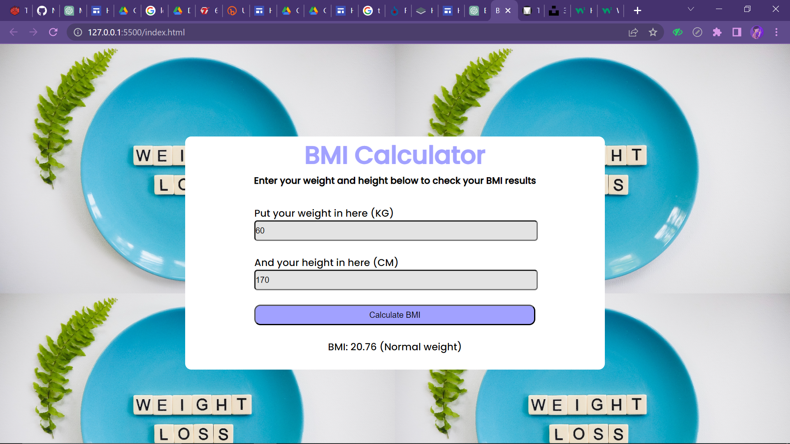

<h1>Penjelasan Program</h1>

<h2>Tampilan saat di running</h2>

<h2>Tampilan saat di isi</h2>

<ol>
  <li>document.addEventListener("DOMContentLoaded", function() {...}): Event listener ini akan dieksekusi ketika semua elemen dalam dokumen HTML telah selesai dimuat dan diinisialisasi. Dalam event listener ini, seluruh kode JavaScript untuk program BMI akan diletakkan.</li>
  <li>const form = document.querySelector("form");: Script ini digunakan untuk mengambil elemen form HTML menggunakan metode querySelector() yang akan dicari berdasarkan tag form. Elemen ini akan digunakan untuk menangkap input dari pengguna.</li>
  <li>form.addEventListener("submit", function(event) {...});: Script ini menambahkan event listener pada form HTML ketika tombol submit ditekan. Saat tombol ini ditekan, program akan mengeksekusi script yang ada di dalam function. Parameter event digunakan untuk mencegah form mengirimkan data dan me-refresh halaman web ketika tombol submit ditekan.</li>
  <li>event.preventDefault();: Script ini mencegah form HTML mengirimkan data dan me-refresh halaman web ketika tombol submit ditekan.</li>
  <li>const berat_badan = parseFloat(document.querySelector("#berat_badan").value);: Script ini mengambil nilai Berat Badan dari elemen input dengan id berat_badan dan mengubahnya menjadi bilangan pecahan dengan menggunakan fungsi parseFloat(). Hasilnya akan disimpan dalam variabel berat_badan.</li>
  <li>const tinggi_badan = parseFloat(document.querySelector("#tinggi_badan").value);: Script ini mengambil nilai Tinggi Badan dari elemen input dengan id tinggi_badan dan mengubahnya menjadi bilangan pecahan dengan menggunakan fungsi parseFloat(). Hasilnya akan disimpan dalam variabel tinggi_badan.</li>
  <li>const bmi = berat_badan / Math.pow(tinggi_badan / 100, 2);: Script ini digunakan untuk menghitung BMI sesuai dengan rumus yang telah ditentukan. Variabel bmi akan menyimpan nilai BMI.</li>
  <li>let hasil = "";: Script ini menginisialisasi variabel hasil dengan nilai kosong. Nilai variabel ini akan diisi kemudian dengan kategori BMI yang sesuai.</li>
  <li>if (bmi < 18.5) {...}: Script ini melakukan perbandingan pada variabel bmi dan menentukan kategori BMI sesuai dengan standar yang telah ditetapkan.</li>
  <li>document.querySelector("#hasil").innerHTML = BMI: ${bmi.toFixed(2)} (${hasil});: Script ini digunakan untuk menampilkan hasil BMI dan kategori BMI pada elemen dengan id hasil. Hasil BMI akan ditampilkan dalam format string dengan menggunakan fungsi toFixed(2) untuk mengambil 2 angka di belakang koma.</li>
</ol> 